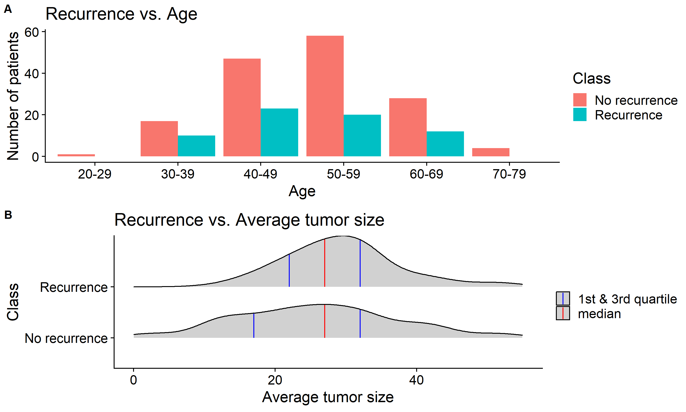
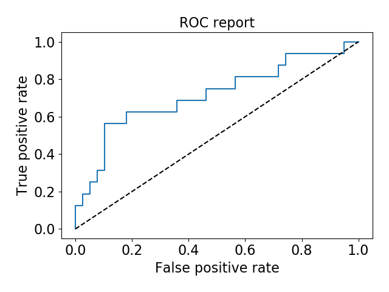

```{r setup, include=FALSE}
knitr::opts_chunk$set(echo = FALSE)
library(knitr)
library(tidyverse)
```

```{r load model results, echo=FALSE, message=FALSE}
model <- read_csv("../results/model_info.csv")
class_info <- read_csv("../results/train_info.csv")
scores <- read_csv("../results/scores.csv")
weights <- read_csv("../results/features_and_weights.csv")

scores <- scores %>% 
  mutate(accuracy = round(accuracy, 2),
         recall = round(recall, 2),
         precision = round(precision, 2),
         `f1 score` = round(`f1 score`, 2),
         `auc score` = round(`auc score`, 2))

weights <- weights %>% 
  mutate(weights = round(weights, 3),
         `abs(weights)` = round(`abs(weights)`, 3))
```

# Summary

We explored to use a logistic regression model to identify strong predictors of breast cancer recurrence. Based on the feature weights assigned in the model, we found that degrees of malignancy are very strong predictors of breast cancer recurrence. The other two predictors, including being in the age 60-69 group and having cancer in the right-up of the breast quadrants, are also among the top five features with the highest absolute weight values. Our model didn't perform well on unseen data, with a fair accuracy score of `r scores$accuracy[2]` and a low recall score of `r scores$recall[2]`. The low recall score is likely due to the data imbalance problem noticed in the training data set. If time permits, we would like to explore some advanced methods to handle the imbalanced data situation and try some advanced feature selection methods to build a better model.

# Introduction

Breast cancer is a type of cancer that develops in the breast. With around 0.3 million women are estimated to be diagnosed with breast cancer in 2019 alone, breast cancer is the second most common cancer found in women [@cancer1]. Breast cancer may come back after the initial treatment, known as breast cancer recurrence [@cancer2]. Based on a medical study in 2010, breast cancer has a high recurrence rate of around 40% [@cancer3]. Although the cause of breast cancer recurrence is not clear, some factors such as age and the tumor size are known to affect the recurrence risk [@cancer2].

In this project, we attempt to answer the question: What are the strongest predictors of breast cancer recurrence? Answering this question will help identify patients who have high risk of breast cancer recurrence. Once we can identify patients with high recurrence risk, we can give patients corresponding treatments to help prevent recurrence events. Besides, finding out factors related to breast cancer recurrence may shed light on understanding the cause of breast cancer recurrence. Thus, it's important to identify strong predictors of breast cancer recurrence.

# Methods

## Data

The breast cancer data set was obtained from the UCI Machine Learning Repository [@Dua2019] and can be found [here](https://archive.ics.uci.edu/ml/datasets/Breast+Cancer). The data set looks at the recurrence and non-recurrence of breast cancer based on 9 features, including groups of age, menopause time, tumor size, ranges of the number of axillary lymph nodes, presence of node in cap, degree of malignancy, breast type, breast quadrant, and whether the patient used radiation therapy. The data set contains 286 instances with missing values. 

## Analysis

The logistic regression algorithm was used to build a classification model to find out the weights of each feature in the data set. All variables in the original data set were used to fit the model. Features, including the tumor size and ranges of the number of axillary lymph nodes, were converted to the average number and used as numeric variables, while other features were treated as categorical variables. The hyperparameter `C` for logistic regression was chosen with 5-fold cross-validation based on the recall score. The Python programming language [@Python], the R programming language [@R] and the following Python/R packages were used: Pandas [@mckinney-proc-scipy-2010], NumPy [@oliphant2006guide, @walt2011numpy], Altair [@Altair2018], scikit-learn [@pedregosa2011scikit], docopt [@docopt], knitr [@knitr], tidyverse [@tidyverse], cowplot [@cowplot], ggridges [@ggridges]. The code used to perform the analysis and create this report can be found here: https://github.com/UBC-MDS/DSCI_522_Group_301.


# Results and Discussion

Before exploring any features, We first analyzed the rate of breast cancer recurrence in the training data set. Only around `r round(100*class_info$value[1]/(class_info$value[1] + class_info$value[2]), 1)`% of the patients had breast cancer recurrence events, while `r round(100*class_info$value[2]/(class_info$value[1] + class_info$value[2]), 1)`% of them don't have any recurrence events. So the training data set is not well balanced, and we decided to address this question by scoring our model with metrics such as the recall score.

Some factors such as "younger age, particularly those under age 35" and "larger tumor size" are known to increase the risk of breast cancer recurrence [@cancer2]. To explore the training data set, we would like to first look at how breast cancer recurrence is related to age and tumor size.

To understand the relation between breast cancer recurrence events and age, we made a plot to show the age distribution of patients with or without breast cancer recurrence. Based on figure 1A, most of the patients in the training data set are between the ages of 30 and 69. Patients at ages 30-39 are more likely to have breast cancer recurrence than other age groups.

To study the relation between breast cancer recurrence events and the tumor size, we first converted the tumor size range to the corresponding average tumor size and then visualized the average tumor size distribution of patients with or without breast cancer recurrence. From figure 1B, we see that the 0.25 quantile and the mean of the average tumor size of patients with breast cancer recurrence are bigger than those without breast cancer recurrence. So "larger tumor size" is related to breast cancer recurrence events.

```{r figure1, echo=FALSE, fig.cap="Figure 1. Breast cancer recurrence is related to age and average tumor size in the training data set.", out.width = '80%'}

```

Known that the data set reflects the relation between breast cancer recurrence and age or the tumor size, we then started to look for features that are good at predicting breast cancer recurrence. We decided to train a simple logistic regression model to calculate weights for each feature in the training data set. We used 5-fold cross-validation with the recall score to determine the performance of a logistic regression model. We observed that the optimized hyperparameter `C` for logistic regression is `r model$value[1]`.

Table 1 shows feature weights from our best logistic regression model. The top five features with the highest absolute weight values are from the categories of the degree of malignancy, age, and cancer location on the breast quadrants. The degree of malignancy is clearly a strong predictor of breast cancer recurrence, with a degree of 3 strongly (meaning a high absolute weight value) related to "recurrence" and a degree of 1 or 2 strongly related to "no recurrence". The feature, being in the age 60-69 group, has a high positive weight value, but the overall trending of weights as age increases is confusing. Besides, having cancer in the right-up of the breast quadrants is another strong predictor. However, some factors that are known related to breast cancer recurrence, including "younger age, particularly those under age 35" and "larger tumor size" [@cancer2], didn't stand out in this analysis.

```{r feature weights table}
kable(weights, 
      caption = "Table 1. Features and corresponding weights in the logistic regression model.")
```

Our model didn't perform well on either the training or test data set. As shown in table 2, the training data set has fair accuracy, precision and auc scores, but very low recall and f1 scores. It suggests that we didn't build a good model to predict "recurrence" events even in the training data set. Furthermore, the test data set has fair accuracy and auc scores, and much lower recall, precision and f1 scores. So it's likely that the model is over-fitted. The ROC report of the test data set in figure 2 also shows that our model performed poorly at predicting "recurrence" events. 

```{r scores table}
kable(scores, 
      caption = "Table 2. Training and test data scores.")
```

```{r figure2, echo=FALSE, fig.cap="Figure 2. ROC curve of the test data set.", out.width = '50%'}

```

If time permits, we want to improve our model in two ways. First, we need to find a better way to handle data imbalance other than just ajusting the scoring method. With an advanced approach to deal with the data imbalance problem, we expect to see a big improvement in the recall, precision, and f1 scores for both training and test data. Second, we want to explore other feature selection methods to help us decide which predictors are better over others. We also need some advice and experience in handling categorical variables during feature selection.

# References